# Lab 2: Visualization using Amazon QuickSight

* [Create an Amazon S3 bucket](#create-an-amazon-s3-bucket)
* [Creating Amazon Athena Database and Table](#creating-amazon-athena-database-and-table)
    * [Create Athena Database](#create-database)
    * [Create Athena Table](#create-a-table)
* [Signing up for Amazon Quicksight Standard Edition](#signing-up-for-amazon-quicksight-standard-edition)
* [Configuring Amazon QuickSight to use Amazon Athena as data source](#configuring-amazon-quicksight-to-use-amazon-athena-as-data-source)
* [Visualizing the data using Amazon QuickSight](#visualizing-the-data-using-amazon-quicksight)
    * [Add year based filter to visualize the dataset for the year 2016](#add-year-based-filter-to-visualize-the-dataset-for-the-year-2016)
    * [Add the month based filter for the month of January](#add-the-month-based-filter-for-the-month-of-january)
    * [Visualize the data by hour of day for the month of January 2016](#visualize-the-data-by-hour-of-day-for-the-month-of-january-2016)
    * [Visualize the data for the month of January 2016 for all taxi types(yellow, green, fhv)](#visualize-the-data-for-the-month-of-january-2016-for-all-taxi-typesyellow-green-fhv)

    

## Architectural Diagram


## Create an Amazon S3 bucket
> Note: If you have already have an S3 bucket in your AWS Account you can skip this section. 

1. Open the [AWS Management console for Amazon S3](https://s3.console.aws.amazon.com/s3/home?region=us-west-2)
2. On the S3 Dashboard, Click on **Create Bucket**. 


3. In the **Create Bucket** pop-up page, input a unique **Bucket name**. It is advised to choose a large bucket name, with many random characters and numbers (no spaces). 

    1. Select the region as **Oregon**. 
    2. Click **Next** to navigate to next tab. 
    3. In the **Set properties** tab, leave all options as default. 
    4. In the **Set permissions** tag, leave all options as default.
    5. In the **Review** tab, click on **Create Bucket**


## Creating Amazon Athena Database and Table

> Note: If you have complete the [Lab 1: Serverless Analysis of data in Amazon S3 using Amazon Athena](../Lab1) you can skip this section and go to the next section [Signing up for Amazon Quicksight Standard Edition](#signing-up-for-amazon-quicksight-standard-edition)

Amazon Athena uses Apache Hive to define tables and create databases. Databases are a logical grouping of tables. When you create a database and table in Athena, you are simply describing the schema and location of the table data in Amazon S3\. In case of Hive, databases and tables don’t store the data along with the schema definition unlike traditional relational database systems. The data is read from Amazon S3 only when you query the table. The other benefit of using Hive is that the metastore found in Hive can be used in many other big data applications such as Spark, Hadoop, and Presto. With Athena catalog, you can now have Hive-compatible metastore in the cloud without the need for provisioning a Hadoop cluster or RDS instance. For guidance on databases and tables creation refer [Apache Hive documentation](https://cwiki.apache.org/confluence/display/Hive/LanguageManual+DDL). The following steps provides guidance specifically for Amazon Athena.

### Setting up Athena (first time users)

If you’re a first time Athena user, you might need to configure an S3 bucket, where Athena will store the query results.


You can use an already existing bucket with a dedicated folder or you can create a new, dedicated bucket.

<b>NOTE:</b> Make sure you have forward slash at the end of the S3 path

### Create Database

1. Open the [AWS Management Console for Athena](https://console.aws.amazon.com/athena/home).
2. If this is your first time visiting the AWS Management Console for Athena, you will get a Getting Started page. Choose **Get Started** to open the Query Editor. If this isn't your first time, the Athena **Query Editor** opens.
3. Make a note of the AWS region name, for example, for this lab you will need to choose the **US West (Oregon)** region.
4. In the Athena **Query Editor**, you will see a query pane with an example query. Now you can start entering your query in the query pane.
5. To create a database named *mydatabase*, copy the following statement, and then choose **Run Query**:

````sql
    CREATE DATABASE mydatabase
````

6.	Ensure *mydatabase* appears in the DATABASE list on the **Catalog** dashboard


### Create a Table

1. Ensure that current AWS region is **US West (Oregon)** region

2. Ensure **mydatabase** is selected from the DATABASE list and then choose **New Query**.

3. In the query pane, copy the following statement to create a the NYTaxiRides table, and then choose **Run Query**:

````sql
  CREATE EXTERNAL TABLE NYTaxiRides (
    vendorid STRING,
    pickup_datetime TIMESTAMP,
    dropoff_datetime TIMESTAMP,
    ratecode INT,
    passenger_count INT,
    trip_distance DOUBLE,
    fare_amount DOUBLE,
    total_amount DOUBLE,
    payment_type INT
    )
  PARTITIONED BY (YEAR INT, MONTH INT, TYPE string)
  STORED AS PARQUET
  LOCATION 's3://us-west-2.serverless-analytics/canonical/NY-Pub'
````

4.Ensure the table you just created appears on the Catalog dashboard for the selected database.

Now that you have created the table you need to add the partition metadata to the Amazon Athena Catalog.

1. Choose **New Query**, copy the following statement into the query pane, and then choose **Run Query** to add partition metadata.

```sql
    MSCK REPAIR TABLE NYTaxiRides
```
The returned result will contain information for the partitions that are added to NYTaxiRides for each taxi type (yellow, green, fhv) for every month for the year from 2009 to 2016

## Signing up for Amazon Quicksight Standard Edition

1. Open the [AWS Management Console for QuickSight](https://us-east-1.quicksight.aws.amazon.com/sn/start).


2. If this is the first time you are accessing QuickSight, you will see a sign-up landing page for QuickSight. 
3. Click on **Sign up for QuickSight**.

> **Note:** Chrome browser might timeout at this step. If that's the case, try this step in Firefox/Microsoft Edge/Safari.

4. On the next page, for the subscription type select the **"Enterprise Edition"** and click **Continue**. 

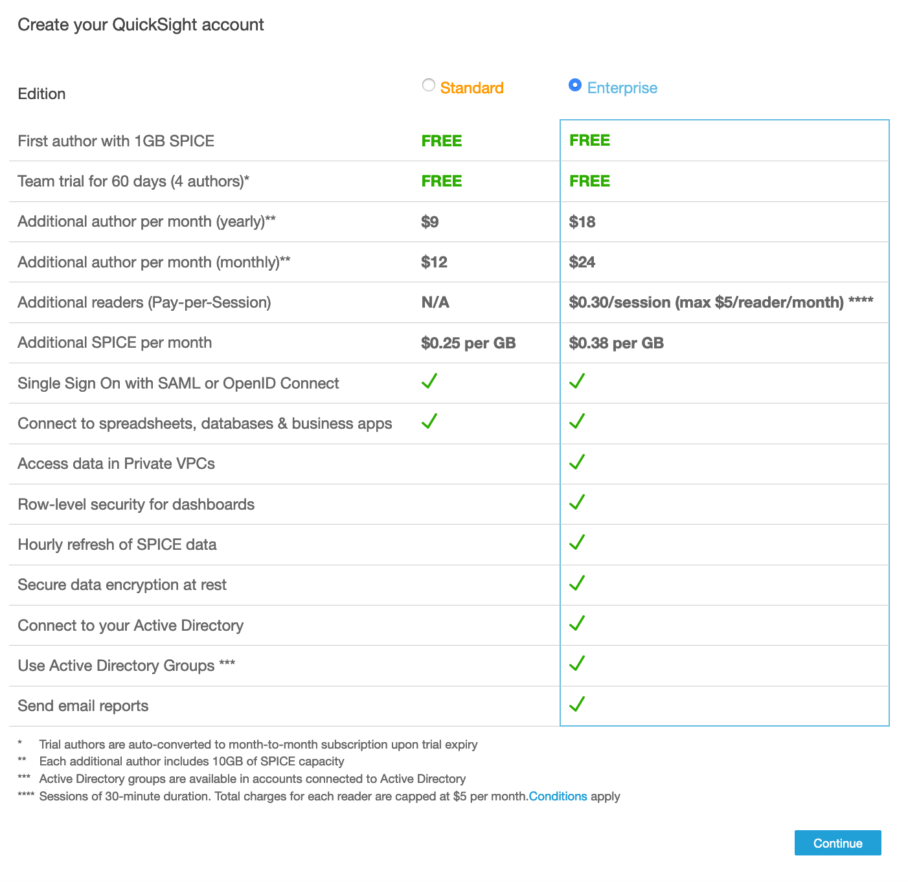

5. On the next page,

   i. Enter a unique **QuickSight account name.**

   ii. Enter a valid email for **Notification email address**.

   iii. Just for this step, leave the **QuickSight capacity region** as **N.Virginia**. 

   iv. Ensure that **Enable autodiscovery of your data and users in your Amazon Redshift, Amazon RDS and AWS IAM Services** and **Amazon Athena** boxes are checked. 

   v. **Click Finish**. 

   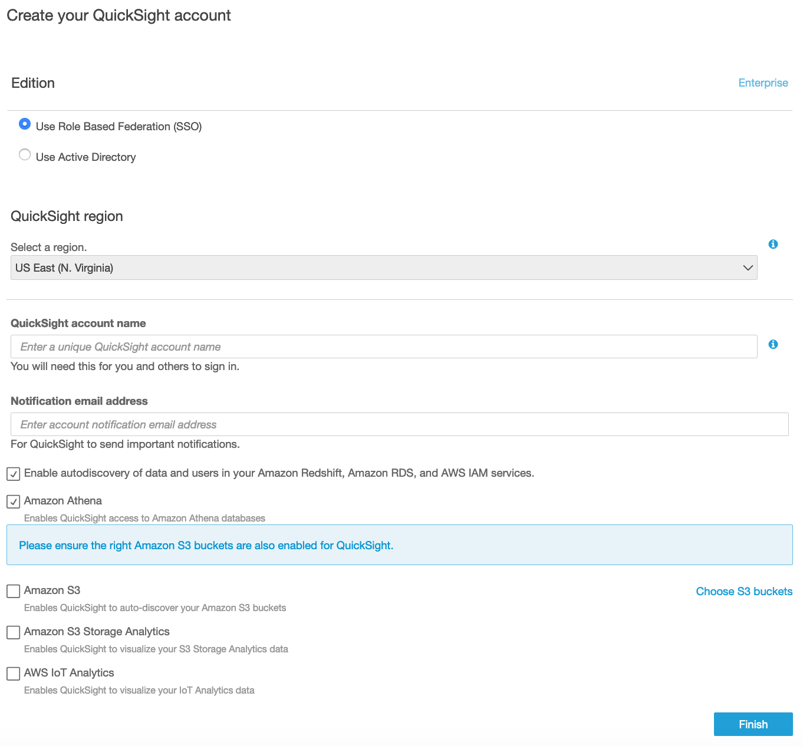

   vi. You will be presented with a message **Congratulations**! **You are signed up for Amazon QuickSight!** on successful sign up. Click on **Go to Amazon QuickSight**. 

6. **Before continuing with the following steps, make sure you are in the N. Virginia Region to edit permissions.**

Now, on the Amazon QuickSight dashboard, navigate to User Settings page on the Top-Right section and click **Manage QuickSight**.

   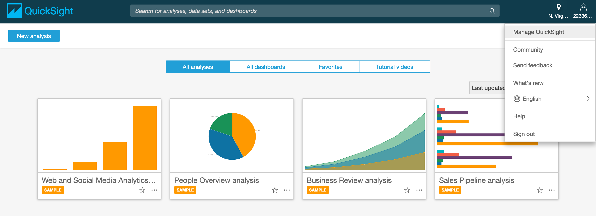

7. In this section, click on **Security & permissions** and then click **Add or remove**.

<p align="center">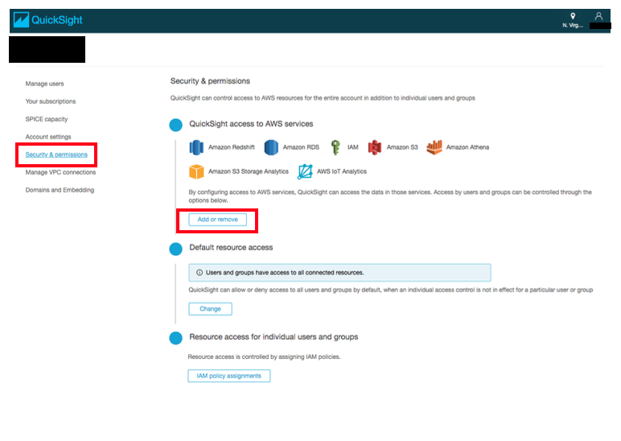</p> 

8. Click on **Amazon S3** and on the tab that says **S3 buckets linked to QuickSight account**.
9. Ensure **Select All** is checked.
10. Click on **Select buckets**.


11. Now, select the **S3 Buckets you can access across AWS** tab on the top right. Make sure **Use a different bucket** is selected. Insert _us-west-2.serverless-analytics_ as the bucket name and select **Add S3 bucket**. It should look similar to below:

<p align="center">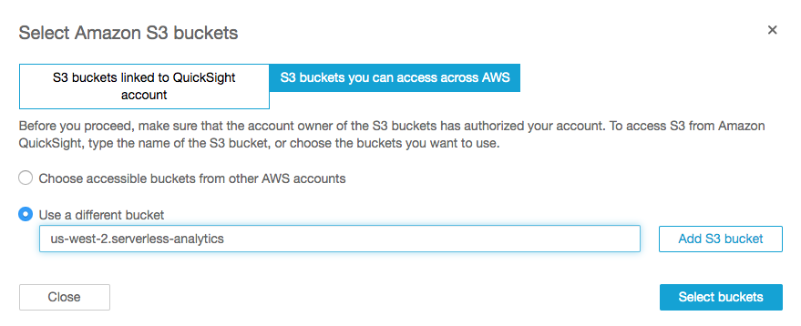</p> 

12. When you are done doing all this, click **Update** to bring you back to the user settings back.

## Configuring Amazon QuickSight to use Amazon Athena as data source

> For this lab, you will need to choose the **US West (Oregon)** region. 

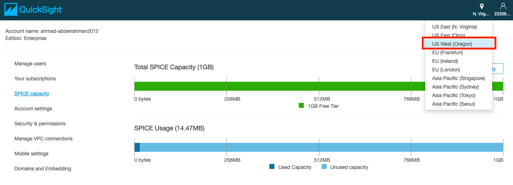

1. Click on the region icon on the top-right corner of the page, and select **US West (Oregon)**. 

2. Click on **Manage data** on the top-right corner of the webpage to review existing data sets.

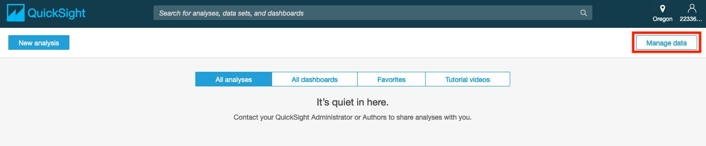

3. Click on **New data set** on the top-left corner of the webpage and review the options. 

4. Select **Athena** as a Data source.

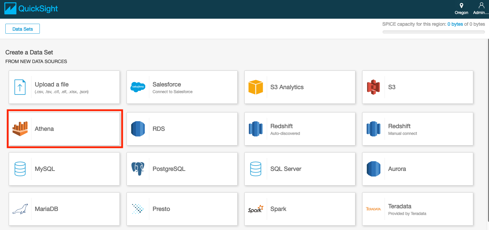

5. Enter the **Data source** **name** (e.g. *AthenaDataSource*).

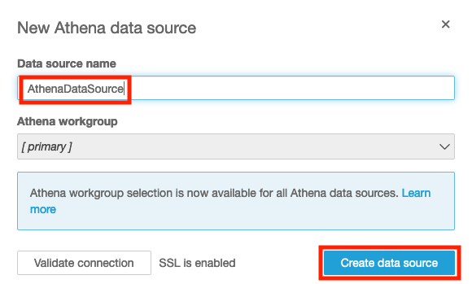

6. Click **Create data source**.
7. Select the **mydatabase** database.

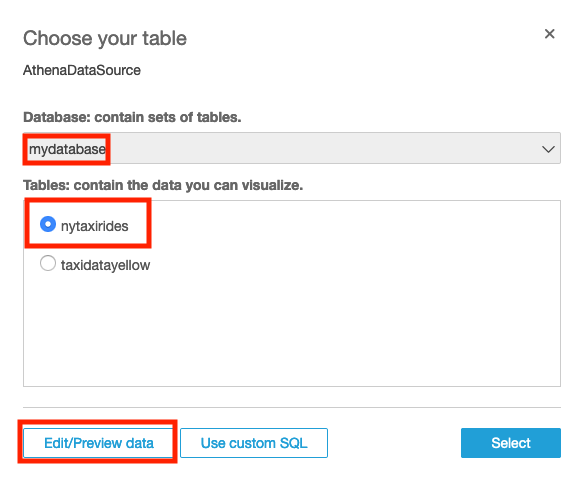

8. Choose the **nytaxirides** table.
9. Choose **Edit/Preview** data.

> This is a crucial step. Please ensure you choose **Edit/Preview** data.

10. Under **Fields** on the left column, choose **Add calculate field**

    i. Select the **extract** operation from Function list.

    ii. Select **pickup_datetime** from the **Field list**.

    iii. For **Calculated field name**, type **hourofday**.

    iv. Type ‘HH’ so the Formula is **extract('HH',{pickup_datetime})**

    v. Choose **Create** to add a field which is calculated from an existing field. In this case, the **hourofday** field is calculated from the **pickup_datetime field** based on the specified formula.

    

11. Choose **Save and Visualize** on top of the page.

## Visualizing the data using Amazon QuickSight

Now that you have configured the data source and created a new field to represent the hour of the day, in this section you will filter the data by year followed by month to visualize the taxi data for the entire month of January 2016 based on the **pickup_datetime** field.

### Add year based filter to visualize the dataset for the year 2016

1. Ensure that current AWS region is **US West (Oregon)** region.

2. Under the **Fields List**, select the **year** field to show the distribution of fares per year.


3. To reformat the **year** without comma

   i. Select the dropdown arrow for the **year** field.

   ii. Select **Format 1,234.5678** from the dropdown menu.

   iii. Select **1235**.

4. To add a filter on the **year** field, 

   i. Select the dropdown for **year** field from the **Fields list**.

   ii. Select **Add filter to the field** from the dropdown menu.

   

5. To filter the data only for the year 2016

   i. Choose the new filter that you just created by clicking on **#** next to filter name **year** under the **Edit filter** menu.
  
   ii. Select **Filter list** for the two dropdowns under the filter name.
  
   iii. Deselect **Select All**.
  
   iv. Select only **2016**.
  
   v. Click **Apply**.
  
   vi. Click **Close**.


### Add the month based filter for the month of January

1. Ensure that current AWS region is **US West(Oregon)** region.
2. Select **Visualize** from the navigation menu in the left-hand corner.
3. Under the **Fields list**, deselect **year** by clicking on **year** field name.
4. Select **month** by clicking on the **month** field name from the **Fields list**.

5. To filter the data set for the month of January (Month 1)

   i. Select the dropdown arrow for **month** field under the **Fields List**.

   ii. Select **Add filter to the field**.

   

6. To filter the data for month of January 2016 (Month 1),

   i. Choose the new filter that you just created by clicking on **#** next to filter name **month** under the **Edit Filter** menu.
 
   ii. Select **Filter list** for the two dropdowns under the filter name.
 
   iii. Deselect **ALL**.
 
   iv. Select only **1**.
 
   v. Click **Apply**
 
   vi. Click **Close**.

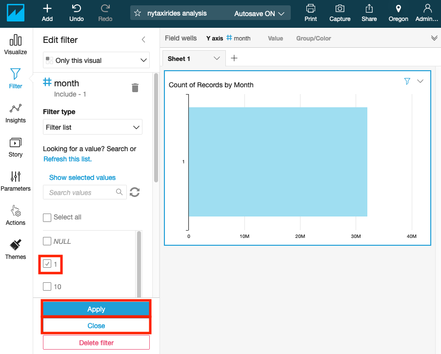

### Visualize the data by hour of day for the month of January 2016

1. Select **Visualize** from the navigation menu in the left-hand corner.
2. Under the **Fields list**, deselect **month** by clicking on **month** field name.
3. Select **hourofday** by clicking on the **hourofday** field name from the **Fields list**.
4. Change the visual type to a line chart by selecting the line chart icon highlighted in the screenshot below under **Visual types**.
5. Using the slider on x-axis, select the entire range [0,23] for **hourofday** field.


### Visualize the data for the month of January 2016 for all taxi types(yellow, green, fhv)

1. Click on the double drop-down arrow underneath your username at the top-right corner of the page to reveal **X-axis**, **Value** and **Color** under **Field wells**.
2. Under the **Fields list**, deselect **hourofday** by clicking on **hourofday** field name.
3. Select **pickup_datetime** for x-axis by clicking on the **pickup_datetime** field name from **Fields list**.
4. Select **type** for Color by clicking on the **type** field name from **Fields list.**

5. Click on the field name **pickup_datetime** in top **Field Wells** bar to reveal a sub-menu.
6. Select **Aggregate:Day** to aggregate by day.

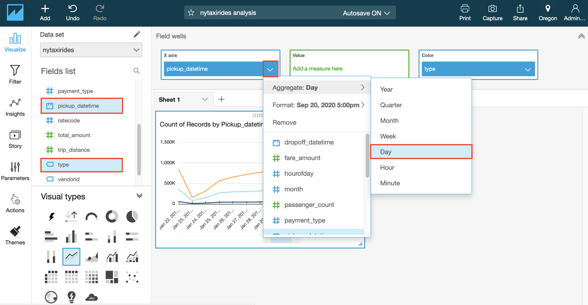

8. Using the slider on x-axis, select the entire month of January 2016 for **pickup_datetime** field.

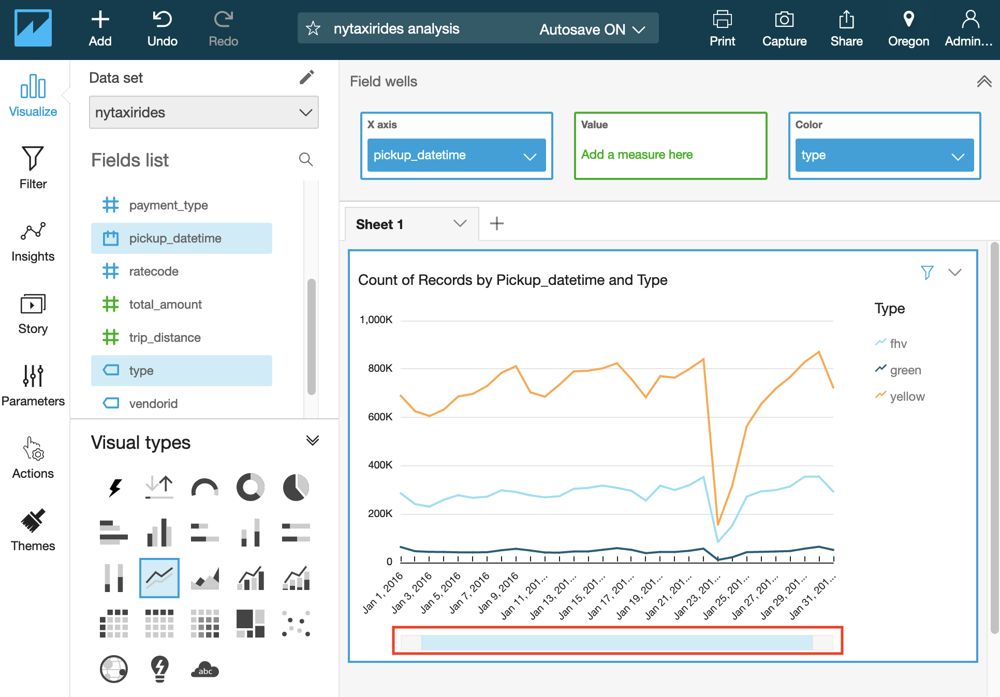

### Forecast Monthly Number of Pickups Trend

1. Create a new visual by clicking on **Add** in the top left corner and choosing **Add visual**.

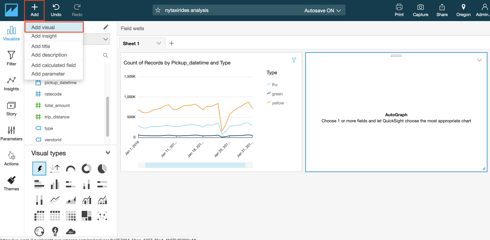

2. Under the **Fields list**, Select **pickup_datetime** for x-axis by clicking on the **pickup_datetime** field name.
3. Change the visual type to a line chart by selecting the line chart icon highlighted in the screenshot below under **Visual types**.
4. Click on the field name **pickup_datetime** in top **Field Wells** bar to reveal a sub-menu.
5. Select **Aggregate:Month** to aggregate by month.

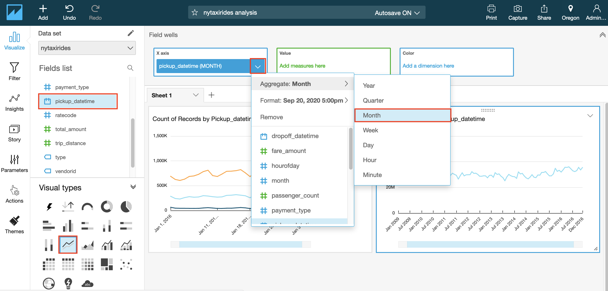

6. Click arrow in top right corner of the visual and select **Add forecast**.

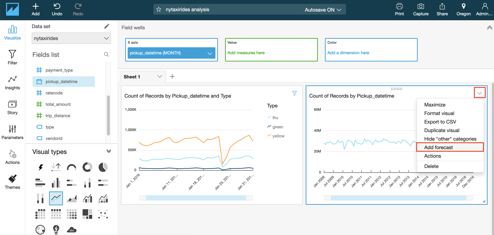


> Note: The interesting outlier in the above graph is that on Jan23rd, 2016, you see the dip in the number of taxis across all types. Doing a quick google search for that date, gets us this weather article from NBC New York
> 

*Using Amazon QuickSight, you were able to see patterns across a time-series data by building visualizations, performing ad-hoc analysis, and quickly generating insights.*

---
## License

This library is licensed under the Apache 2.0 License. 


